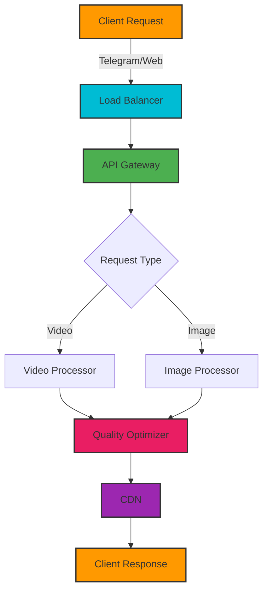
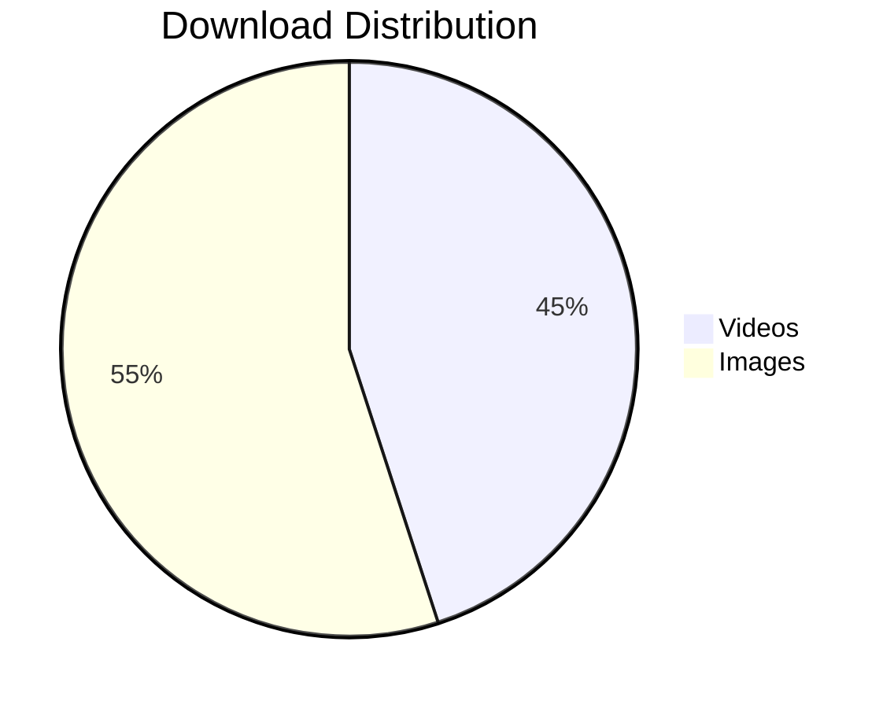
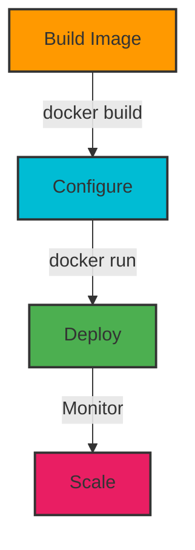
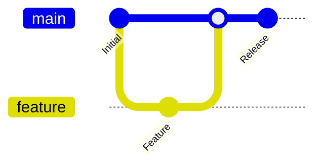

<div align="center">

# 🎯 Pinterest Downloads Bot


[](https://t.me/PintrestDownloadsBot)
[](https://t.me/+qmQRKWhcIM81NjQ1)
[](https://t.me/RektDevelopers)
[](https://github.com/sh33ikh/PintrestDownloadsBot/stargazers)
[](LICENSE)

### 🚀 Ultimate Pinterest Media Downloader for Telegram

*Download high-quality Pinterest videos and images effortlessly through Telegram*

[📱 Try Bot](https://t.me/PintrestDownloadsBot) • [💬 Join Support](https://t.me/+qmQRKWhcIM81NjQ1) • [📢 Updates](https://t.me/RektDevelopers)

</div>

## 🌟 System Architecture



## ⚡ Performance Metrics



## 💎 Core Features

<table>
<tr>
<td width="50%">

### 🎨 Media Features
- 🎥 4K Video Downloads
- 🖼️ HD Image Processing
- 🔄 Batch Processing
- 📊 Quality Analysis
- 🚀 Parallel Downloads

</td>
<td width="50%">

### 🛠️ Technical Features
- ⚡ Real-time Processing
- 🔒 Secure Downloads
- 📱 Cross-platform Support
- 🌐 CDN Integration
- 🔍 Smart Link Detection

</td>
</tr>
</table>

## 🔧 Technology Stack


## 🚀 Quick Setup

```bash
# Clone repository
git clone https://github.com/sh33ikh/PintrestDownloadsBot.git

# Navigate to directory
cd PintrestDownloadsBot

# Install dependencies
pip install -r requirements.txt

# Configure environment
cp .env.example .env

# Launch bot
python main.py
```

## 🐳 Docker Deployment



## 📈 Usage Analytics


## 🤝 Contributing



## 💰 Support Development

```
ETH: 0x6dD47369f097569bA3A61733FCD1D5CF0a5FDD30
```

<div align="center">

## ⭐ Star History

[](https://star-history.com/#sh33ikh/PintrestDownloadsBot&Date)

---

<sub>Built with ❤️ by [RektDevelopers](https://t.me/RektDevelopers)</sub>

</div>
