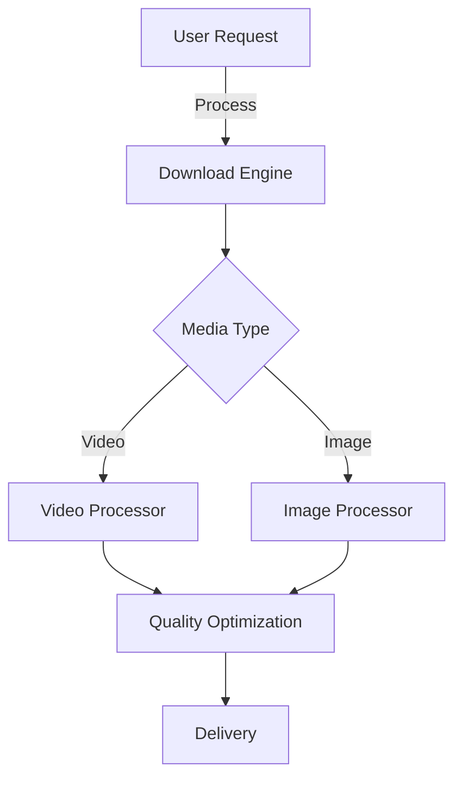
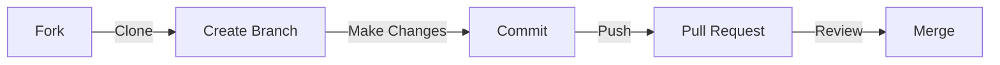

<div align="center">
  
# 📥 Pinterest Downloads Bot


[](https://t.me/PintrestDownloadsBot)
[](https://t.me/+qmQRKWhcIM81NjQ1)
[](https://t.me/RektDevelopers)
[](https://github.com/sh33ikh/PintrestDownloadsBot/stargazers)
[](LICENSE)

### 🚀 Your Ultimate Pinterest Media Downloader for Telegram

Download high-quality Pinterest videos and images effortlessly through Telegram.

[Try Bot →](https://t.me/PintrestDownloadsBot) • [Join Support →](https://t.me/+qmQRKWhcIM81NjQ1) • [Updates Channel →](https://t.me/RektDevelopers)

</div>

## 🌟 Key Features

<table>
  <tr>
    <td>
      <h3>Core Features</h3>
      <ul>
        <li>🎥 4K Video Downloads</li>
        <li>🖼️ HD Image Downloads</li>
        <li>📊 Usage Analytics</li>
        <li>🔄 Real-time Processing</li>
      </ul>
    </td>
    <td>
      <h3>Advanced Features</h3>
      <ul>
        <li>👥 User-friendly Interface</li>
        <li>🚀 Lightning-fast Downloads</li>
        <li>💫 Bulk Download Support</li>
        <li>🔐 Secure Processing</li>
      </ul>
    </td>
  </tr>
</table>

## 📊 Project Stats



## 🛠️ Technology Stack

<table>
  <tr>
    <td align="center"><br>Python 3.9+</td>
    <td align="center"><br>Docker</td>
    <td align="center"><br>Telegram API</td>
    <td align="center"><br>RapidAPI</td>
  </tr>
</table>

## 🚀 Quick Setup Guide

### Prerequisites
- Python 3.9 or higher
- pip package manager
- Telegram Bot Token
- RapidAPI Key

### Installation Steps

1. **Clone & Navigate**
   ```bash
   git clone https://github.com/sh33ikh/PintrestDownloadsBot.git
   cd PintrestDownloadsBot
   ```

2. **Install Dependencies**
   ```bash
   pip install -r requirements.txt
   ```

3. **Configure Environment**
   ```bash
   cp .env.example .env
   # Edit .env with your credentials
   ```

4. **Launch**
   ```bash
   python main.py
   ```

## 🐳 Docker Deployment

```bash
# Build container
docker build -t pinterest-bot .

# Run container
docker run -d --env-file .env pinterest-bot
```

## ⚙️ Configuration

| Variable | Required | Description | Example |
|----------|----------|-------------|---------|
| `BOT_TOKEN` | ✅ | Telegram Bot Token | `5432109876:ABCdefGHIjklMNOpqrsTUVwxyz` |
| `REQUIRED_CHANNEL` | ✅ | Force Subscribe Channel ID | `-1001234567890` |
| `RAPIDAPI_KEY` | ✅ | RapidAPI Key | `a1b2c3d4e5f6g7h8i9j0` |
| `CHANNEL_USERNAME` | ❌ | Updates Channel | `RektDevelopers` |
| `SUPPORT_GROUP` | ❌ | Support Group Link | `https://t.me/+qmQRKWhcIM81NjQ1` |

## 🤝 Contributing

We welcome contributions! Here's how you can help:



1. Fork the repository
2. Create your feature branch: `git checkout -b feature/AmazingFeature`
3. Commit changes: `git commit -m 'Add AmazingFeature'`
4. Push to branch: `git push origin feature/AmazingFeature`
5. Open a Pull Request

## 📝 License

This project is under the MIT License. See [LICENSE](LICENSE) for details.

## 💬 Community & Support

- 🔧 [Support Group](https://t.me/+qmQRKWhcIM81NjQ1)
- 📢 [Updates Channel](https://t.me/RektDevelopers)
- 📫 [Report Issues](https://github.com/sh33ikh/PintrestDownloadsBot/issues)

## ☕ Support Development

If you find this bot helpful, consider supporting its development:

```
ETH: 0x6dD47369f097569bA3A61733FCD1D5CF0a5FDD30
```

<div align="center">

## 🌟 Star History

[](https://star-history.com/#sh33ikh/PintrestDownloadsBot&Date)

---
<sub>Made with ❤️ by [RektDevelopers](https://t.me/RektDevelopers)</sub>
</div>
